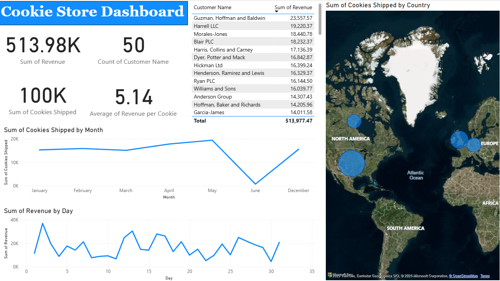

# 🍪 Cookie Store Power BI Dashboard

This Power BI dashboard provides a comprehensive overview of customer behavior, sales performance, and shipping trends for a cookie business. It uses customer and order data to generate valuable insights into revenue, shipping volume, and regional performance.

---

## 🖼 Dashboard Overview

---

## 💡 Key Metrics

- **📦 Total Revenue**: $513,980  
- **🧍 Number of Customers**: 50  
- **🍪 Total Cookies Shipped**: 100,000  
- **💰 Average Revenue per Cookie**: $5.14  

---

## 📈 Visualizations

### 🔹 Customer Revenue Leaderboard
- A ranked table showing top customers by total revenue.
- Helps identify key accounts and repeat buyers.

### 🔹 Cookies Shipped by Country (Map)
- A filled map showing cookie shipment distribution.
- Larger bubbles indicate higher shippin
### 🔹 Monthly Cookies Shipped (Line Chart)
- Tracks total cookie shipments month-over-month.
- Detects seasonality or growth in orders.

### 🔹 Daily Revenue Trends (Line Chart)
- Visualizes revenue by day of the month.
- Highlights spikes and lulls in sales activity.

---

## Dax Measures in Dax_measures.md
